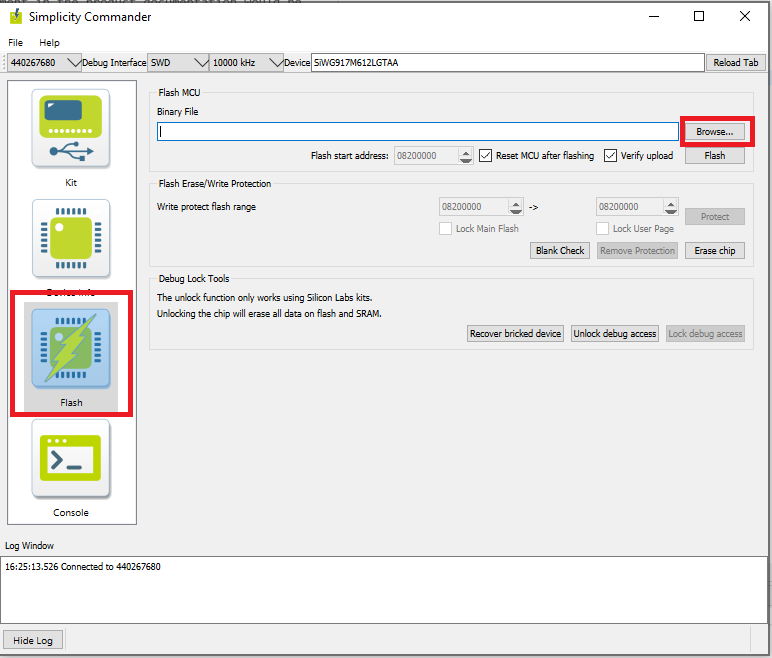
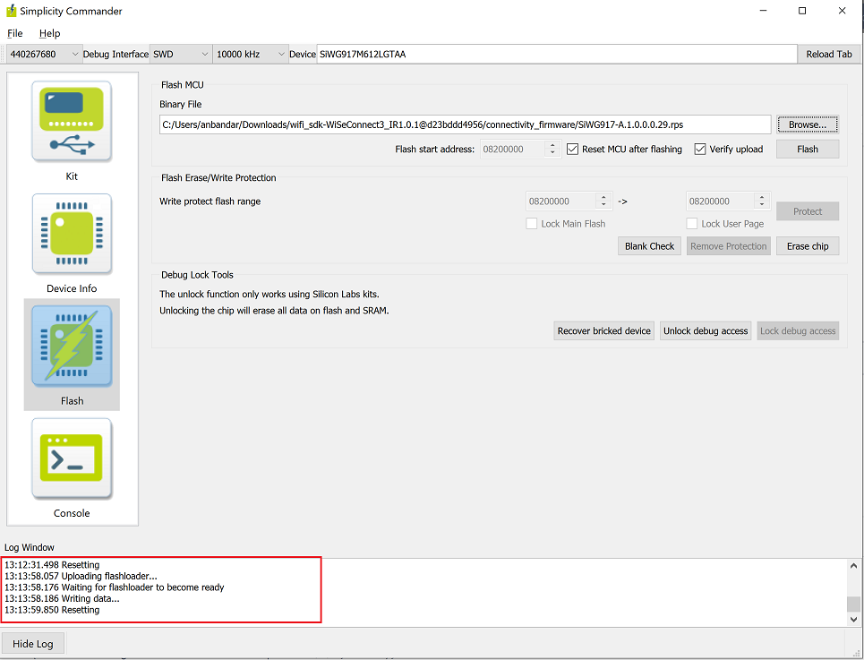
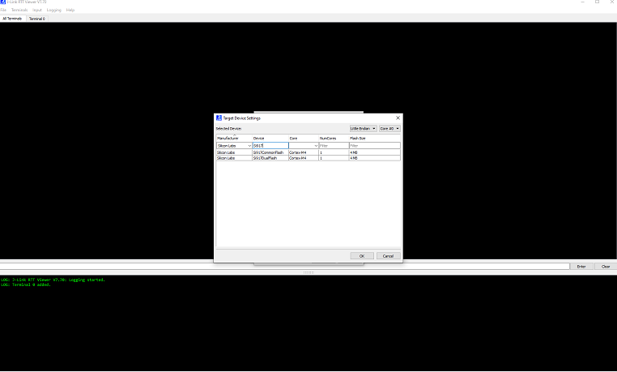
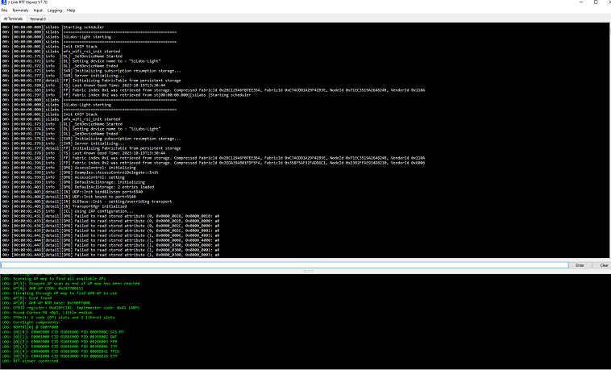

# Getting Started with SoC Mode

This guide describes how to get started developing an application for the SiWx91x in System-on-chip (SoC) mode, where both the application and the networking stack run on the SiWx917 chipset.

## Check Prerequisites

In order to run Matter over Wi-Fi, check for the following prerequisites:

### Hardware Requirements

The following hardware devices are required for executing Matter over Wi-Fi:
 - Refer, [Hardware Requirements](../general/HARDWARE_REQUIREMENTS.md#matter-over-wi-fi-accessory-device-requirements-for-soc-mode)
- Silicon Labs Wireless starter/development kit (WSTK)
- SiWx917 SoC development kit
- Wi-Fi Dev Kit
  - SiWx917
    - SoC mode:
      - BRD4388A (B0 2.0 common flash)
             SiWx917
- Windows/Linux/MacOS computer with a USB port
- USB cable for connecting WSTK Board to Computer
- Raspberry Pi with a >32 GB SD Card
- Access Point with Internet Access

### Software Requirements

Refer to [Software Requirements & Installation ](../general/SOFTWARE_REQUIREMENTS.md)

## Connect SiWx917 SOC to Computer

1. Mount the SiWx917 radio board on the SiWx917 WSTK board.
    
   
    
2. Connect your SiWx917 Wireless Starter Kit (WSTK) board to your computer using a USB cable.

### Steps to update the firmware on SiWx917 SoC radio board using Simplicity Commander

1. Open Simplicity Commander application.

3. In the Simplicity Commander window, click Select Kit and choose your radio board.

   

4. In the navigation pane, go to the Flash section.

5. Click Browse next to the Binary File field.
   
   

6. Refer [Firmware for SiWx917 SoC](../general/ARTIFACTS.md#siwx917-firmware-for-siwx917-soc) to identify the which firmware to be flashed into the specific hardware. Locate and select the firmware file to flash.  

7. Click Flash

   

8. The firmware will be flashed and the Log Window will display a "Resetting" message.

   

### Troubleshoot SiWx917 SOC Firmware Update Failure
If the firmware update fails, try the following:
  - Toggle the power switch towards AEM (Advanced Energy Monitoring) on the WSTK board.
  - Perform the following steps and try the firmware update again
     - Toggle the ISP switch towards ISP on the radio board.
     - Press the RESET button on the WSTK board.
     - Toggle the ISP switch away from ISP on the radio board.
     - In the Flash section in step 5 above, click Erase chip.
     - The flash will be erased.
     - Retry the firmware upgrade.


## Building Matter Application on SOC device
- To build Matter Application on SOC device, refer [Building Procedure](./SW_SETUP.md)

## Flashing Images/Binaries on the SiWx917 SoC platform using Ozone and Simplicity Commander

1. SiWx917 SoC device support is available in the latest Simplicity Commander(version 1v15p3). To flash the TA Firmware/Matter application on SiWx917 SoC,
    - Convert the .s37 file into .rps file using the below command,
         
      ```shell
      commander rps create <output file with .rps extension> --app <input file with .s37 extension>
      ```

    - Flash to the device using,          
    
      ```shell
      commander rps load <file-name>.rps
      ```

2. Official support for SiWx917 SoC for Common Flash Board is not yet available in the Ozone Debugger, but can be configured - [Ozone Environment Setup for SiWx917 SoC](SiWx917_Enablement_For_Ozone.md).

3. After creating the rps file flash the binary to the board by using Simplicity Commander, refer [Flashing SiWx917 SOC Using Simplicity Commander](../general/FLASHING_USING_COMMANDER.md#flashing-the-siwx917-soc-matter-pre-built-binary-using-simplicity-commander)

4. Flashing the Matter application using Ozone Debugger

   - Download the Pre-built images for SiWx917 SoC Matter Application (.out file) from [Matter Artifacts page](../general/ARTIFACTS.md)
   - Refer [Flashing MATTER Application Using Ozone debugger](./SiWx917_Enablement_For_Ozone.md)
   - Go to *Demo Execution - Commissioning a SiWx917 SoC Device using chip-tool for Linux* section, to run the demo with SiWx917 SoC

**Note:**
1. SiWx917 SoC Common flash boards are not supported by Ozone.
2. To enable RTT logs, download **JlinkDevices.xml** file from the [Matter Artifacts page](../general/ARTIFACTS.md) and install in the Jlink installation path.
 
## Enabling JLink RTT Logs for SOC Boards
1. To Configure the JLink RTT Viewer for SOC board, refer [Configure JLink RTT](./SiWx917_Enablement_For_Ozone.md#steps-to-configure-the-siwx917-soc-on-the-jlink-rtt-logging-and-ozone-debugger)

2. Open JLink RTT Viewer and click on three dots beside **Specify Target Device**

   

3. select Manufacturer as **Silicon Labs** and device section search `Si917CommonFlash` or `Si917DualFlash` as per board connected to machine then click "ok" 

   

4. Select Target Interface as `JTAG` & Speed as `8000KHz`(Default) then click "ok"

5. Now the JLink-RTT is connected and will print the device logs
   
   

## Demo Execution - Commissioning a SiWx917 SoC Device using chip-tool for Linux

> **Note**: Commissioning can be done using chip-tool running either on Linux or Raspberry Pi.

1. Get the SSID and PSK of the Wi-Fi network (WPA2 - Security) you are connected to.

2. Run the following:

    ```shell
    $ cd $MATTER_WORKDIR/matter
    ```

    ### Commissioning Command:

    ```shell
    $ out/standalone/chip-tool pairing ble-wifi 1122 $SSID $PSK 20202021 3840
    ```

> **Note:**
>    1. The Node ID used here is `1122`. This will be used in future commands.
>    2. The below given steps (3, 4, 5) are for Lighting-app, use app specific commands if you are using any other application.

3. To turn **on** the LED on the SiWx917:
    ```shell
    $ out/standalone/chip-tool onoff on 1122 1
    ```

4. To turn **off** the LED on the SiWx917:
    ```shell
    $ out/standalone/chip-tool onoff off 1122 1
    ```

5. The updated **on/off** state may be verified with the following command:
    ```shell
    $ out/standalone/chip-tool onoff read on-off 1122 1
    ```

If you are having difficulty getting the chip-tool to commission the device
successfully, refer to the troubleshooting information on the 
[Running the Matter Demos over Wi-Fi on EFR32 hosts page](./RUN_DEMO.md).

As the device remembers the Access Point credentials given for commissioning, if
you want to run the demo multiple times, do a [Factory Reset](./SiWx917_Enablement_For_Ozone.md#siwx917-soc-factory-reset).

The commissioning command mentioned above does the following:

- chip-tool scans BLE and locates the Silicon Labs device that uses the specified discriminator
- Sends the Wi-Fi SSID and Passkey
- The Silicon Labs device will join the Wi-Fi network and get an IP address.
It then starts providing mDNS records on IPv4 and IPv6
- chip-tool then locates the device over Wi-Fi and establishes operational certificates
- Future communications (tests) will then happen over Wi-Fi
