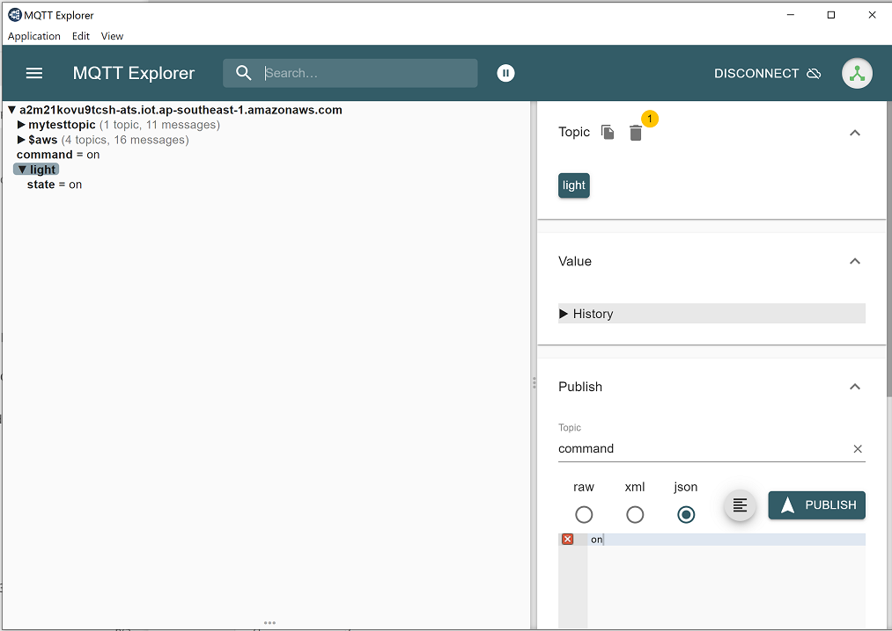

# Matter Wi-Fi Direct Internet Connectivity
-  Direct Internet Connectivity (DIC) is a silabs only feature to connect matter devices to proprietary cloud solutions(AWS,GCP,APPLE ...) directly.  As such, a Matter Wi-Fi device must support connecting locally on the Matter Fabric, via IPv6, and connecting to the Internet via IPv4.
-  Matter devices can be controlled by chip-tool or controller and the respective status of the attribute modified will be published to the cloud.
-  Remote user can install the cloud specific application to get the notification on the attribute status.

## DIC Feature Diagram
1. Below diagram gives end-to-end flow about Direct Internet Connectivity.
  
  

## Prerequisites

### Hardware Requirements
- Hardware required for DIC feature to run on Silicon Labs Platform, refer [Matter Hardware Requirements](../general/HARDWARE_REQUIREMENTS.md)

### Software Requirements
- [Download](https://github.com/thomasnordquist/MQTT-Explorer/releases/download/0.0.0-0.4.0-beta1/MQTT-Explorer-Setup-0.4.0-beta1.exe) MQTT Explorer Software for controlling device through cloud.
- Software required for DIC feature, refer [Software Requirements](../general/SOFTWARE_REQUIREMENTS.md)

## End-to-End Set-up bring up
## Message Queuing Telemetry Transport (MQTT)

- MQTT is an OASIS standard messaging protocol for the Internet of Things (IoT). It is designed as an extremely lightweight publish/subscribe messaging transport that is ideal for connecting remote devices with a small code footprint and minimal network bandwidth. Refer https://mqtt.org/ for more details

### Configuration of MQTT server

To set up and configure AWS or Mosquitto for DIC support please see the following documentation: 
   - [AWS installation](./AWS_CONFIGURATION_REGISTRATION.md)
   - [Mosquitto installation](./MOSQUITTO_SETUP.md)

### Remote User Setup (MQTT Explorer)
     
  - A remote user is used to check the state of device. In this context MQTT explorer is used as a remote user.
  - [MQTT explorer setup and configuration](./MQTT_EXPLORER_SETUP.md)

### Building Matter DIC Application
1. To Build DIC Application, refer [Building of DIC](./BUILD_DIC.md)
2. Commission the Matter Device and confirm DIC connection is done from Device side logs.

## End-to-End Test of DIC Application

  - **Sharing status of device to cloud**
    - Below diagram gives end-to-end flow for sharing status from matter device to cloud
      
      

**Note**: For reference, Lighting App commands given in the above image. Similarly other application commands also can be passed. 
    - End-to-end command to be executed from chip-tool, refer [Running the Matter Demo](RUN_DEMO.md#demo-execution---commissioning-a-wi-fi-device-using-chip-tool-for-linux)
    - Below is the application specific attribute/s information or state shared to the cloud through Direct Internet Connectivity Solution
       - For Lighting App, On/Off Attributes
       - For Lock App, lock/unlock Attributes
       - For On/off Plug App, On/Off Attributes
       - For Windows App, lift/tilt Attributes
       - For Thermostat App, SystemMode/CurrentTemp/LocalTemperature/OccupiedCoolingSetpoint/OccupiedHeatingSetpoint Attributes
    - Application status would be updated on the mqtt_explorer UI, as shown in below image.
      
  

  - **Control of the device through cloud interface**
     - Below diagram gives end-to-end flow for Control of the matter device through cloud interface
      
      

**Note**: For reference, Lighting App commands given in the above image. Similarly other application commands also can be passed.
     
- Make sure matter device is up and commissioned successfully, refer [Running the Matter Demo](RUN_DEMO.md#demo-execution---commissioning-a-wi-fi-device-using-chip-tool-for-linux)
     
- For Controlling the device, set topic name and the commands to be executed in the mqtt_explorer for below applications.
  - Lighting App
    - Topic: command
      - Commands:
        - toggle
        - on
        - off
  - Onoff-plug App
    - Topic: command
      - Commands:
        - toggle
        - on
        - off
  - Lock App
    - Topic: command
      - Commands:
        - lock
        - unlock
  - Thermostat App
    - Topic: command
      - Commands:
        - SetMode/value(value need to provide 1,2,3,4 ex:SetMode/1)
        - Heating/value(value need to provide 2500,2600 ex:HeatingSetPoint/2500)
        - Cooling/value(value need to provide 2500,2600 ex:CoolingSetPoint/2500)
  - Window App
    - Topic: command
       - Commands:
        - Lift/value(value need to provide in range 1000 to 10000  ex: Lift/2500)
        - Tilt/value(value need to provide in range 1000 to 10000  ex: Tilt/2500)
- Then click `publish` button to execute the command.

  

- **Download AWS OTA Image through cloud interface**
     - Below diagram gives the end to end flow of firmware upgrade feature through AWS.
      
       
     - Build DIC with AWS OTA , refer [Building DIC AWS OTA](./BUILD_DIC.md#build-command-with-dic-aws-ota)
     - Make sure matter device is up and commissioned successfully, refer [Running the Matter Demo on EFR Hosts](RUN_DEMO.md) or [Running the Matter Demo on SiWx917 SoC Hosts](RUN_DEMO_SiWx917_SoC.md)
     - Make sure device is connected to MQTT Server successfully.
     - Then Create a AWS OTA Job in the AWS Website, refer [How to create AWS OTA JOB](AWS_CONFIGURATION_REGISTRATION.md)
     - Trigger OTA Command through MQTT Explorer like below.
     - Then click `publish` button to execute the AWS OTA command.
   
       